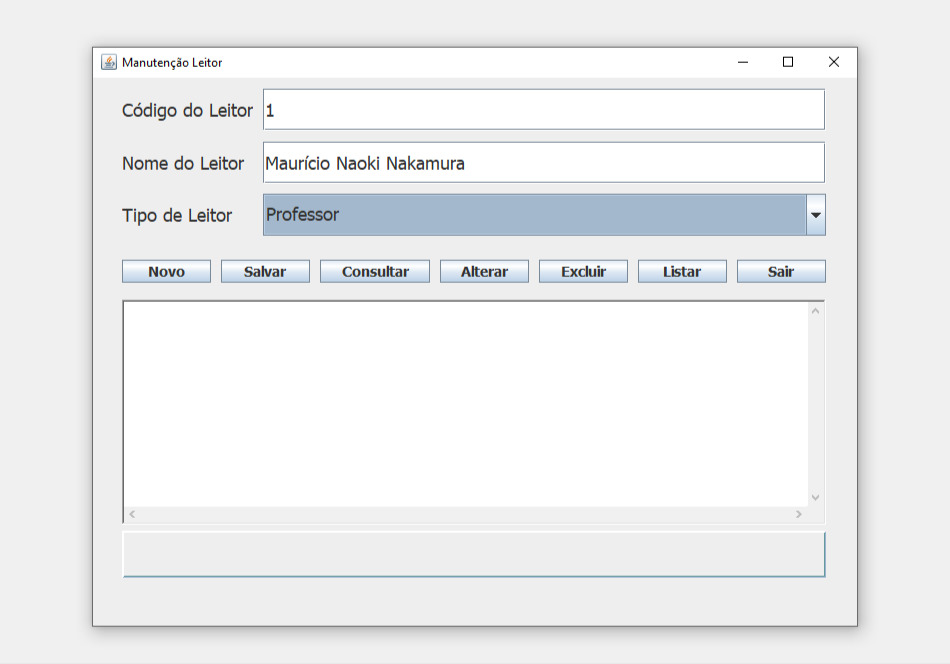

<div align="center"> <h1>Sistema de Leitor</h1> </div>

<div align="center">
  
</div>

## 📝 Sobre o projeto

Esta aplicação, desenvolvida em Java, oferece funcionalidades para o gerenciamento de usuários, como adição, edição, exclusão e listagem. As informações são armazenadas em um banco de dados MySQL, garantindo a persistência dos dados.

## 🛠 Tecnologias utilizadas

-   **Java** - Linguagem de programação
-   **MySql** - Banco de dados relacional

## 🖥️ Como configurar o projeto

Siga os passos abaixo para instalar e executar o projeto em seu ambiente local:

### 1. Clone o repositório:

```bash
$ git clone https://github.com/mauricio071/Sistema-de-leitor
```

### 2. Acesse o diretório do projeto:

```bash
$ cd Sistema-de-leitor
```

### 3. Importe o projeto em uma IDE compatível com Java:

É Recomendado o uso de uma IDE como o Eclipse ou IntelliJ IDEA para abrir e compilar o projeto.

### 4. Configure o banco de dados MySQL:

- Crie um banco de dados no MySQL.
- Atualize o arquivo de configuração do projeto com as credenciais e a URL do banco de dados.

### 5. Execute o projeto na sua IDE:

Após configurar o banco de dados e ajustar as credenciais, execute a aplicação diretamente pela IDE.
